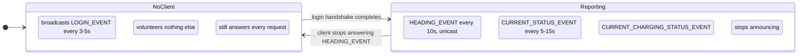

# Device behaviour

What an EVSEMaster-protocol charger does on the wire, independent of any client.

## Two independent things

Chargers behave as if these were one thing, and they are not.

**Authorisation is per packet.** The password sits at bytes 13–19 of every frame. There is
no handshake that unlocks anything: each packet is authorised on its own. A client that
never sent a login gets `NICKNAME_EVENT` and `OUTPUT_AMPERAGE_EVENT` answered; the same
requests with a wrong password get `PASSWORD_ERROR_EVENT`.

**Commands therefore always work**, whatever the registration below is doing. A charge
start or stop is accepted and acted on by a charger that is sending no telemetry at all.

**The client registration is separate.** The charger keeps a record of one address it
reports to, and sends `HEADING_EVENT`, `CURRENT_STATUS_EVENT` and
`CURRENT_CHARGING_STATUS_EVENT` only there. It is charger-side state, it can be lost, and
losing it changes nothing about whether commands are accepted.

Whether a charger can hold more than one registration at a time is untested.

## The client registration

The two modes are sharply separated. A charger that has a client announces essentially
never; one without a client announces every few seconds and sends nothing else. A single
announcement means little, but a **sustained announcement beat means the charger has no
client.**

## The keepalive contract

`HEADING_EVENT` (0x0003) is the heartbeat that holds the registration open, and the most
important behaviour here:

- The charger sends it roughly every 10 seconds, **only while it holds a registration**.
  Whether it is unicast or broadcast is unconfirmed: emproto states unicast, but the
  charger has no provisioned server IP, so only a packet capture can settle it.
- The client must answer `HEADING_RESPONSE` (0x8003).
- **If the client stops answering, the charger drops the registration** and reverts to
  announcing.

A client that stops receiving headings for longer than one interval should assume it has
been dropped and log in again, rather than wait for a long timeout. Because headings are
emitted only while a registration is held, their arrival - not traffic in general - is what
proves it is alive. Replies to requests the client itself sent prove only reachability.

What causes a charger to drop a registration in practice is not established. Neither
reference implementation knows either; both simply detect it quickly and log in again.

## Login handshake

1. Client sends `LOGIN_REQUEST` (0x8002).
2. Charger answers `LOGIN_SUCCESS_EVENT` (0x0002) with its device description, or
   `PASSWORD_ERROR_EVENT` (0x0155).
3. Client sends `LOGIN_CONFIRM_RESPONSE` (0x8001), completing the handshake.
4. The charger begins reporting. The first status can take a few seconds.

`LOGIN_EVENT` (0x0001) carries the same device-description payload as
`LOGIN_SUCCESS_EVENT`, but it is the unsolicited broadcast announcement, not a reply.

The send port differs per unit and per firmware, and must always be learned from the
source address of incoming packets rather than assumed. Observed: Telestar EC311S 21937,
BS20 30139, Ocular 46540. A first request sent to a guessed port commonly goes unanswered;
by the retry, an inbound broadcast has usually revealed the real one.

## What the client must answer

| Charger sends | Client must send | Consequence of silence |
|---|---|---|
| `HEADING_EVENT` 0x0003 | `HEADING_RESPONSE` 0x8003 | registration dropped |
| `CURRENT_STATUS_EVENT` 0x0004 | `CURRENT_STATUS_RESPONSE` 0x8004 | - |
| `LOGIN_SUCCESS_EVENT` 0x0002 | `LOGIN_CONFIRM_RESPONSE` 0x8001 | handshake never completes |
| `UPLOAD_LOCAL_CHARGE_RECORD` 0x000A | optional acknowledgement | record is rebroadcast forever |

## Stored network configuration

The charger holds its own Wi-Fi configuration, readable and writable under command 0x010A
with a sub-operation byte (0x01 set, 0x02 query). The 105-byte payload carries the network
name at offset 1, the passphrase at 33, a **server IP at offset 99 and a server port at
103**.

Measured on a Telestar EC311S: the server IP is **0.0.0.0** and the port is **28376**. The
charger therefore has no provisioned unicast target, and 28376 is wired in rather than
learned.

**The charger always answers to port 28376, never to the source port of the request.** A
client that sends from any other port gets no reply at all, however well-formed the query.
This is why every implementation binds 28376 specifically.

Two further properties of this frame, both confirmed by measurement:

- **The passphrase is returned in plaintext.** Anything that logs or reports a raw 0x010A
  frame leaks the network's Wi-Fi credentials.
- **Device-to-client frames fill the six password bytes with `0xFF`**, and those bytes count
  toward the checksum.

## Charging records

When a session ends the charger uploads a record and **keeps rebroadcasting it until an app
acknowledges it**. A charger that has never been acknowledged holds a backlog and replays
it continuously - one record every few seconds, indefinitely.

This does not affect the registration; a charger with thousands of unacknowledged records
reports telemetry normally. The queue is shared with the vendor app, so acknowledging a
record here may prevent that app from ever downloading it.

## Timings

Measured on a Telestar EC311S over 20.7 hours registered, cross-checked against
[emproto](https://github.com/johnwoo-nl/emproto).

| Behaviour | Measured | Reported elsewhere |
|---|---|---|
| `HEADING_EVENT` interval | 10.09s, ~100% delivered | 10s (emproto) |
| `CURRENT_STATUS_EVENT` interval | 15.1s median, 31s worst | 5–10s (emproto) |
| `LOGIN_EVENT` with no client | every 3.0s | ~5s (emproto) |
| `LOGIN_EVENT` while registered | 2 in 20.7h | - |
| Charge record replay | every 3.6s | - |
| Registration considered lost after | - | 15s without a heading (emproto) |
| Device considered offline after | - | 11s (emproto)|

Status cadence is firmware-dependent; treat 5–15s as the range and the heading beat as the reliable clock.

## Per-model quirks

- **Amperage changes mid-charge.** A Telestar EC311S applies the output amperage only when
  a charge *starts*. It echoes a mid-session change back within seconds and then ignores
  it: the same 16 A limit measured 9.3 A when set mid-session and 15.3 A when the session
  was restarted with it. Lowering additionally faults minutes later. A BS20 accepts changes
  mid-charge, but interrupts charging for roughly twenty seconds to do so.
- **Reservations without a car.** A pending reservation reports `CHARGING_RESERVATION` even
  with nothing plugged in, so `NOT_CONNECTED` means nothing is scheduled.
- **Reported power is per phase.** On a three-phase charger the power field carries one
  phase only; summing the measured phases is correct on both single and three phase.
- **Payload sizes vary.** Single-phase chargers send 25-byte status payloads with no L2/L3
  block against 33 for three-phase. Some firmwares report status under 0x000D and charging
  status under 0x0006.
- **Unmapped enum values are normal.** A BS20 reports plug state 16. Firmware reports values
  no client has mapped, and one unknown byte must not cost the whole packet.
- **The device clock drifts.** It can be weeks out, it is interpreted as Asia/Shanghai local
  time, and nothing corrects it on its own. Every timestamp the charger reports depends on
  it.

## Corrections to earlier notes

Two things previously recorded in this project's `CLAUDE.md` are contradicted by
measurement and by both other implementations:

- **Headings stop when no client is registered.** They are emitted only while a registration
  is held, which is why they vanish entirely once it is lost, so their arrival is a valid
  liveness signal. Whether they are unicast or broadcast is still unconfirmed.
- **Heading delivery is not ~40% lossy.** Over 20.7 hours registered, 7387 arrived against
  7378 expected. The earlier figure was measured while no registration was held.
